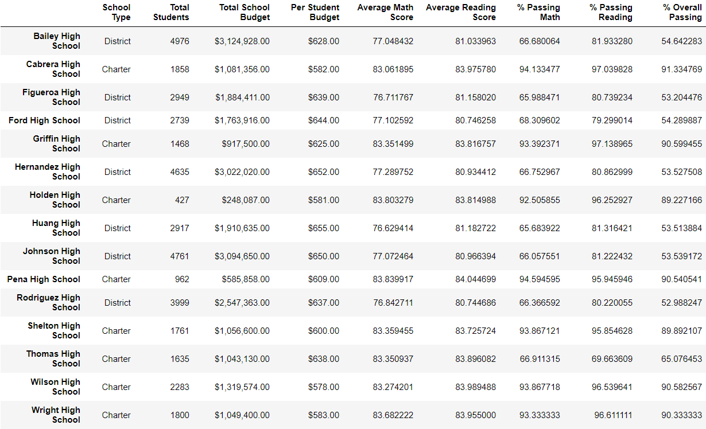
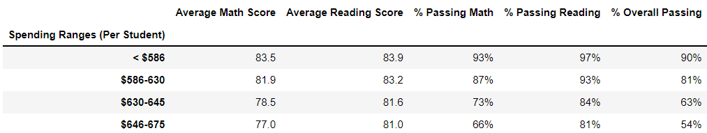
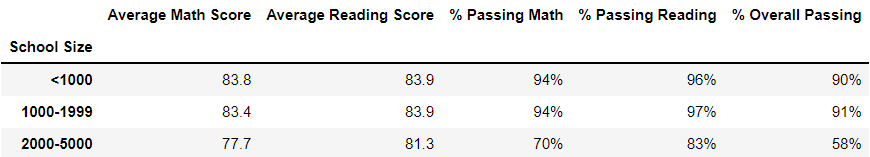
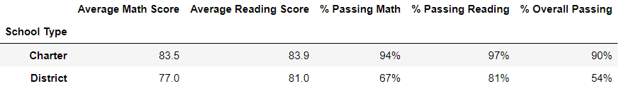
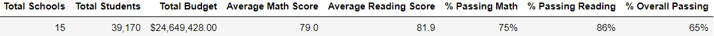
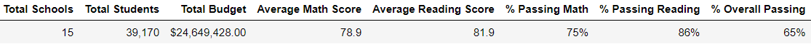
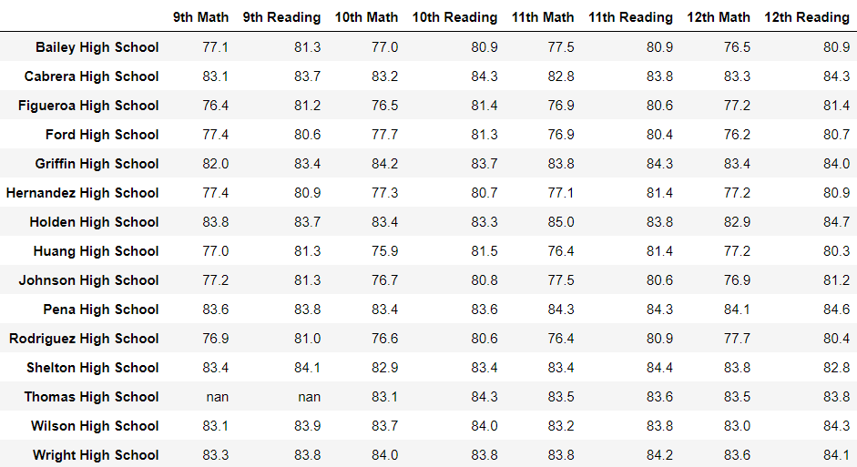

# school_district_analysis

## Overview of the school district analysis:
<!-- Explain the purpose of this analysis. -->
The board of education for a local school district requires insights on recent student testing data to inform strategic decisions regarding budget allocation for the upcoming school year. The data gathered is based on the past academic year's standardized testing data for the district. The results from 9th graders at Thomas High School was invalidated due to testing security concerns. The overall analysis yields information about:

* Average scores on both math and reading tests for each school in the district
* The percentage of students deemed proficient by state standards (above 70% correct) on the individual math and reading tests for each school in the district
* The percentage of students deemed proficient by state standards (above 70% correct) on both the math and reading tests for each school in the district

The above information was then analyzed further by grouping the schools in regards to the following criteria:

* The school's budget per student (broken into 4 equally distributed categories)
* The school's size (broken into 3 equally distributed categories)
* The school's type (Public or Charter)

### Resources Used

* Data Source: schools_complete.csv
* Data Source: students_complete.csv
* Software: Jupyter Notebook 6.4.8

## Analysis For the Board of Education: 

The tablesbelow show final results from the analysis:

### Summary of Data by Schools

The summary of each school's performance on this year's standardized testing shows several schools grouped around 90% overall pass rates, and several schools grouped around 50% overall pass rates. At first glance it appears most of the schools with high pass rates are Charter schools with relatively small student populations, while most of the schools with low pass rates are schools associated with the Public School District with relatively larger student populations.

<!-- Scores by school spending -->
### Summary of Data by School Budget Groups

The data on school budgets shows a slight negative correlation between money spent per student and average test scores. As spending per student increases the scores for both math and reading tests decrease slightly. This trend seems counterintuitive at first glance, but when taken into account with other demographic information about size and type of schools, this information begins to paint a more coherent picture.

<!-- Scores by school size -->
### Summary of Data by School Size Groups

The data on school size appears to show a slight negative correlation between school size and average test scores. While there does not appear to be a substantial difference in performance between small schools (less than 1000 students) and medium schools (1000-1999 students), there is a significant dropoff in test scores for large schools (2000-5000 students). This dropoff in scores may be due to other factors than just the amount of students in the school, as the trend here is not as consistent as other tables show.

<!-- Scores by school type -->
### Summary of Data by School Type

The data on school type shows a significant difference in the performance of charter schools vs. public schools in the district. While the average math and reading scores are within several points of each other, the school district's pass rate on the math test is 27% lower than the same pass rate at charter schools. This appears to have also affected the overall passing rates by a similar difference of 36% lower for the public schools in the district.

## The Effect of Test Security Issues At Thomas High School
<!-- Using bulleted lists and images of DataFrames as support, address the following questions. -->

### District and School Summaries

<!-- How is the district summary affected? -->
The issues at Thomas High School appear to have had little to no effect on the district's overall testing scores. The only slight difference appeared in the average math score, which dropped by 0.1. The changes can be seen in the two tables below.

#### District Summary Before Score Nullifications

#### District Summary After Score Nullifications

----------------------------------------------------------------------------------------------
<!-- How is the school summary affected? -->
The school summary also was relatively unaffected by the changes at Thomas High School. The only difference is the loss of data for Thomas High School's 9th grade math and reading scores. As all of these results were invalidated, those results are now null values in the table. All other scores were unaffected, as none of the other student results were invalidated. Those results can be found in the table below.

----------------------------------------------------------------------------------------------
How does replacing the ninth graders’ math and reading scores affect Thomas High School’s performance relative to the other schools?

How does replacing the ninth-grade scores affect the following:
Math and reading scores by grade
Scores by school spending
Scores by school size
Scores by school type
Summary: Summarize four changes in the updated school district analysis after reading and math scores for the ninth grade at Thomas High School have been replaced with NaNs.
